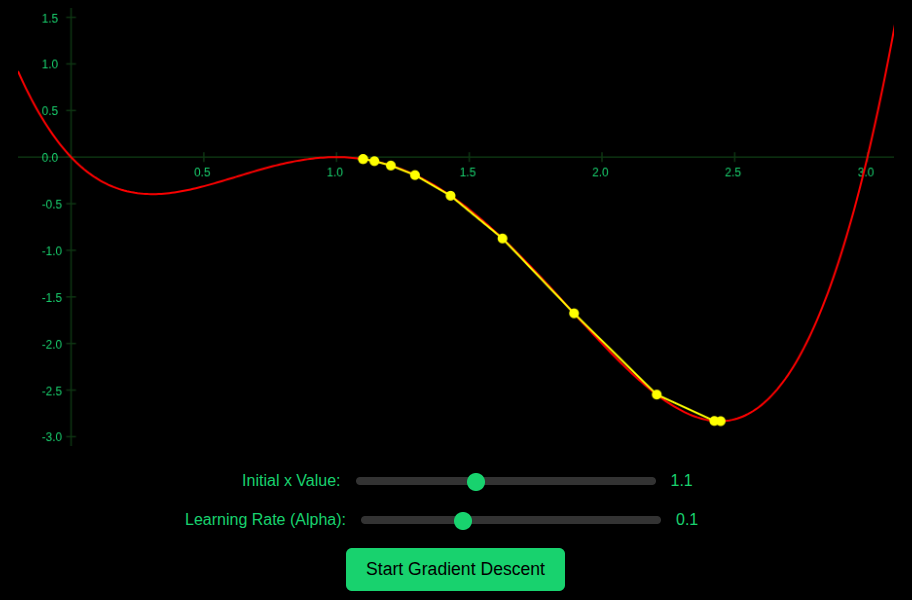

# Gradient Descent Visualization

[](https://gradient-descend2.vercel.app/)

An interactive web-based tool for visualizing the gradient descent algorithm in 2D. This project demonstrates how the algorithm converges towards a local minimum by iteratively updating the input based on the gradient of the function:  

f(x) = x^4 - 5x^3 + 7x^2 - 3x 

This function, which is a fourth-degree polynomial, exhibits multiple turning points and provides a clear visual representation of how gradient descent behaves in the presence of local minima and maxima.


[](https://gradient-descend2.vercel.app/)

## Features

- **Dynamic Visualization**: Watch the gradient descent steps as the algorithm iterates towards the minimum.
- **Adjustable Parameters**:
  - Initial `x` value: Set the starting point of the algorithm.
  - Learning rate (α): Modify the step size of the gradient descent.
- **Real-Time Feedback**: See how different parameter values affect the convergence behavior.

## Getting Started

### Setup

1. **Clone the Repository**:

2. **Run Locally**:
   - Open `index.html` in your browser to start the visualization.

## Usage

1. Open the tool in your browser.
2. Adjust the **Initial x Value** slider to set the starting point of the gradient descent.
3. Modify the **Learning Rate (α)** slider to control the step size.
4. Click **Start Gradient Descent** to see the algorithm in action.

### Example Output

As the gradient descent progresses:
- A point moves along the curve, iteratively approaching a local minimum.
- The trail of yellow lines indicates the steps taken by the algorithm.

## Customization

- Modify the function f(x) and its derivative in the `js/gradient.js` file:
```javascript
function f(x) {
 return x**4 - 5*x**3 + 7*x**2 - 3*x;
}

function f_prime(x) {
 return 4*x**3 - 15*x**2 + 14*x - 3;
}
```

- Adjust convergence settings by changing the threshold value.

- Adjust the `x` and `y` axis ranges as well as the label separation
```javascript
const minX = -0.2;
const maxX = 3.3;
const tickXstep = 0.5;

const minY = -3.1;
const maxY = 1.6;
const tickYstep = 0.5;
```

## Contributing
Contributions are welcome! If you'd like to suggest improvements, feel free to open an issue or submit a pull request.

