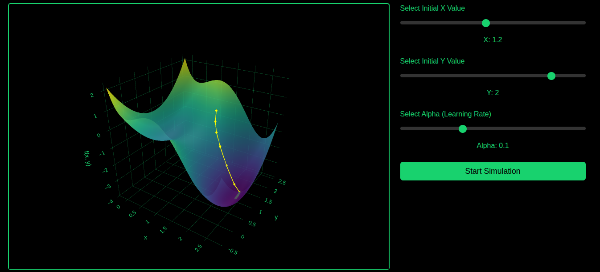

# Gradient Descent 3D Visualization

An interactive web-based tool for visualizing the gradient descent algorithm in 3D. This project demonstrates how the algorithm converges towards a local minimum by iteratively updating the input based on the gradient of the function:

f(x, y) = x^4 - 5x^3 + 7x^2 - 3x + y^2 - 2y

This function exhibits multiple turning points and provides a clear visual representation of how gradient descent behaves in the presence of local minima and maxima.

👉 **[Try it live here!](https://gradient-descend3.vercel.app/)**

## Features

- **Interactive 3D Plot**: Visualize the function surface using Plotly.js.
- **Parameter Controls**: Adjust initial values for `x` and `y`, as well as the step size (`alpha`) using sliders.
- **Simulation**: Observe step-by-step iterations of the gradient descent process.
- **Dynamic Updates**: Real-time plotting of the algorithm's progress.

## Getting Started

### Installation

1. **Clone this repository**
2. **Run Locally:**
    - Open `index.html` in your browser to start the visualization.

## Usage

1. Open the tool in your browser.
2. Adjust the **Initial x Value** and the **Initial y Value** sliders to set the starting point of the gradient descent.
3. Select the **Learning Rate (α)** slider to control the step size.
4. Click **Start Simulation** to see the algorithm in action.

### Example Output

As the gradient descent progresses:
- A point moves along the surface, iteratively approaching a local minimum.
- The trail of yellow lines indicates the steps taken by the algorithm.

## Contributing
Contributions are welcome! If you'd like to suggest improvements, feel free to open an issue or submit a pull request.